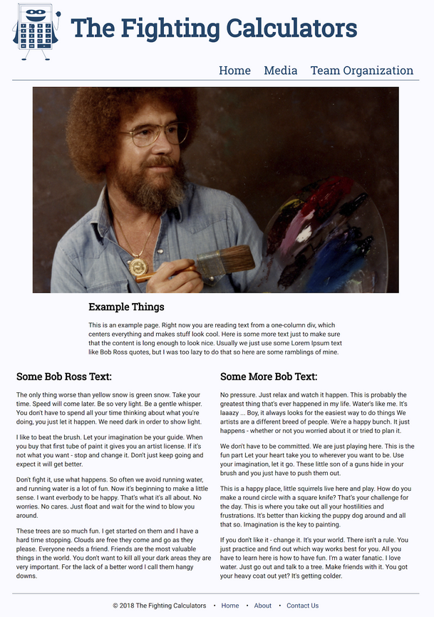

# FRC 2175 Website

The team's website, hosted at https://fightingcalculators.org/. This version of the site is written in NodeJS.

## A Guide to Doing Stuff

The first step to working on the website is to get a current copy of the code on your computer. To do that, we need to download a few things:

- Git, a version control system that allows multiple people to make changes to a codebase and merge all of those changes into a master copy that other people can download and make changes to.

    Download: https://git-scm.com/ 

- Node, which is a JavaScript program that allows us to run JavaScript code on a server. This is the basis of all that we are doing here, because without Node we wouldn’t be able to do any of this.

    Download (choose LTS): https://nodejs.org/en/

- Yarn, a package manager, which allows us to manage all of the external JavaScript libraries that we use (like ExpressJS). It also will manage the running of the server.

    Download: https://yarnpkg.com/lang/en/ 

Once you have all of those downloaded (the default options are probably fine) the next step is to use Git to download a copy of the codebase.

1. Open up the newly installed Git Bash application by pressing the windows key and searching for “Git Bash”. 

2. Open up Windows file explorer by pressing the windows key and the “e” key at the same time. 

3. In file explorer, make a new folder somewhere to store all of your code projects. I have one called “repos”, short for “repositories” which are codebases stored in something like git.

4. Figure out what the path to that folder is. Next, in git bash, use the cd command to change directories to the folder you just created. 

Example: let’s say that I opened git bash and want to go to my repos folder. If my repos folder is in my documents folder, I would enter the following: 

```
cd Documents (enter)
cd repos (enter)
```

Now you should be in the folder you just made.

Type the following command into git bash: 

```
git clone https://github.com/frc-2175/website
```

Now, if you type `ls` into git bash and hit enter, you should see a new folder called website. If you `cd website` and `ls` again, you should see a few folders and a few files. You now have the codebase on your computer.

Now that you have the website code on your computer, it’s time to see the website in a browser.

1. While still in git bash in the website folder, run the following command: `yarn`. This will install all of the JS libraries that our project depends on. They weren’t included on the repository because the files are really big and take a long time to push to the repository.

2. Next, run the command `yarn start`. This will start our web server on your computer. This allows you to visit the website.

3. Open a browser and put `localhost:8000` in the address bar. You should see some sort of website thing pop up. This is the result of all of the code you just downloaded! 
*Note: If it says `App running on port 2175 in development mode` in the terminal then `localhost:2175` is what works.*

### Adding a Page

Now that you have the code on your computer, it’s time to write some yourself. The only prerequisite is that you know most of JavaScript, as well as basic HTML. If you don’t, then you can go through some of the [codecademy JavaScript tutorial](https://www.codecademy.com/learn/introduction-to-javascript) which shouldn’t take too long if you already have some code experience.

The first step you can take to adding a page is getting familiar with our codebase. Our folder structure looks (at the time of writing) like this:

```
├── node_modules
├── package.json
├── src
│   ├── index.js
│   └── templates
│       . . .
├── static
│       . . .
│   └── style.css
└── yarn.lock
```

Let’s dissect it.

```
├── node_modules
```

This folder stores all of the libraries that our project depends on, also called dependencies. This is all of the stuff that yarn installed when you ran the yarn command. This includes ExpressJS, but also all of the ExpressJS dependencies, and each of those have dependencies, and so on. That’s why this folder gets so big, and that’s why we don’t include it in the repository.

```
    ├── package.json
```

This file stores a list of all of the dependencies for our project. When you run the yarn command, yarn looks at this file and installs all of the dependencies it lists. Package.json also serves as a general configuration file for yarn. In fact, it’s here that we define some commands for running and watching the server. That `yarn start` command you ran earlier comes from this file.

```
    └── yarn.lock
```

I skipped over to this file because it relates to package.json. While package.json stores the names of the dependencies we need, yarn needs to know exactly what version of each dependency we need. That’s what the yarn.lock file does. Also, package.json only stores a list of each top-level dependency. Yarn.lock stores not only those but the sub-dependencies and the sub-sub-dependencies and so on. For those reasons, this file is massive. It’s something like 2,000 lines long. But, it’s crucial to yarn.

```
├── src
```

This folder is probably the most important folder in the project to you. This is where almost all of the code that you write will be stored. In fact, there’s already a bunch of code in there. Cool.

```
│   ├── index.js
```

This is the most important file in the entire project. This one file is what starts the server and sets up what is called _routing_, which is a term that describes the way a website’s file structure is set up. That’s sort of like what we’re doing right now; we’re looking at a `file structure`, or a collection of folders and files. When you go to a website, like frc2175.slack.com, you go to the homepage of the website. Then, after clicking around a bit, if you look at your search bar the URL has changed a bit. Now it says something like frc2175.slack.com/messages/id/12030201302 (I just made that up). The structure of the URL is the routing. This file also sets up our template stuff.

```
│   └── templates
```

This sub-folder of src is meant to hold all of our template files. Template files are those like base.html that define styles and layouts like our header and footer, as well as how text looks. Template files are written in a hybrid of a weird new language called Nunjucks and HTML. This is what allows us to keep the exact same general look and feel on every page of the website without rewriting code.

```
├── static
```

This is a folder for holding all of our static assets, or things that never change and are referred to by other files in our src directory. If you start the server and navigate to localhost:8000/static/Bob-Ross.jpg, you’ll get a nice Bob Ross photo. And, if you look in the static directory of the project, you’ll see the same file there. That should give you a good idea of how static files work. The server is able to do this because of a certain line in index.js that uses a fancy Express thing to serve those files.

```
│   └── style.css
```

This is another really important code file, but it’s in the static directory. This is because CSS code is really considered an asset, not a part of our source. This file houses all of our CSS code, or code that makes everything look nice. That’s how we did all of the basic design and stuff. This won’t be an important code file to all of you, since you will hopefully not have to mess with it too much.

So that’s the project so far. It will probably get bigger and more complex, but we’ll all be educated by then. So how would one actually go about adding a page to the website? To show you, I created an example page that you can find by going to localhost:8000/example. It’s pretty simple, but it’s close to the final design of what a lot of pages are going to look like: featured image, bunch of text, multiple columns, that kind of thing. Here’s a screenshot to preview your reward:



So, let’s get into it. A step-by-step guide to making a page on our website. Oh boy. 

Before we actually start to code, you need an editor to code in. You can use virtually anything (Notepad++ will do), but if you want something with a little more power, Atom, Visual Studio Code, or Sublime Text will all do fine. I think they all have plugins for Nunjucks, which is what we need.

  *if you're on an MSA computer, there could be an error saying Node isn't recognized... if that happens, Run your editor in Admin mode then open the folder*

1. First things first, let’s make a file. The place that we’re storing all of our pages so far is the templates folder, because our pages use Nunjucks. So, make a new file in that folder and name it something clever, like yourname.html. Don’t name it “yourname.html”. Just choose something that makes sense. Also make sure the extension is .html.

2. Next, we need to extend our base template. What this does is basically copy all of the content from the base template like the header and footer, but let’s us overwrite certain areas like the content or the title. We can do this by using a Nunjucks tag. Nunjucks tags are sort of like HTML tags, except they look like this: `` instead of the normal HTML tag. The tag to extend a file is simply extends and then the name of the file you want to extend. So your first line of the file will look like: ``

3. The next thing we need to do is edit those areas that we said we could overwrite from base.html. Those areas are called blocks in Nunjucks, and they have their own tags as well. In base.html, there is a block called title that is meant to replace the page title (the one displayed on the tab in your browser). The way we edit a block is by opening a block tag and give the name of the block. Then after the tag, we can override the title, and after that we close the block. Let’s say we want the title of the page to be Example. This would look like:

    ```
    
    Example
    
    ```

    The above title will actually display as Example | Fighting Calculators because of some other setup in base.html. So when you override the title block, you are only editing some of the title.

4. The last (but longest) part of the page is going to be the content block. This is the stuff that goes between the header and the footer. For this walkthrough, we are going to have a big featured image, a one-column text, and a two-column text (although from the homepage you can see that any number of columns would be possible). The first thing we need to do is to open up another block, called content. That would look like:

    ```
    
    ...
    
    ```

    Inside of a block you can just have some normal html. Just imagine that you are already inside of an html body, and now we can start writing the page itself. First up is our image. Find an image on the internet somewhere, preferably something a lot wider than it is tall (see both of the features already present on the repo). Save it in the static folder in the project and give it a good name. Next, add your image to the page with the html img tag. The src attribute should be “/static/whatever your picture is called”. Give it a class of featured so that it gets centered and looks all nice. An example of this would be: ``

5. Next we’re going to add some text. Let’s start with something with one column and centered. To do that, we’ll have two divs: one that defines the total area for the one column text to go, and another for the actual column inside of that. The first div will have a class of “one-column” and the second one will have a class of “column”. This will make a bit more sense when we do more than one column. Then, inside of the column div goes our text inside some `<p></p>` tags every paragraph.

_Diversion Time_: Lorem Ipsum is a term that basically means sample text. It references the original sample text that starts with Lorem Ipsum and then has some more latin stuff. Turns out it’s actually some weird philosophical stuff, but it doesn’t really matter. Its purpose is to give you some text to see how content looks on a website without having to write anything yourself. That’s pretty boring, so when making the current home page we decided to use some fancier Lorem Ipsum with Bob Ross quotes in it. There are a bunch of other Lorem Ipsum generators out there, and there are some cool ones on [this list](https://www.shopify.com/partners/blog/79940998-15-funny-lorem-ipsum-generators-to-shake-up-your-design-mockups) (beware some explicit content on one of the sites) so go and choose one to use for your page. Maybe make it go with your image if you’re feeling particular outgoing. Some sites have an option to insert `<p>` tags for each paragraph, so make sure to do that.

Your div setup should look like this inside your block:

```html
<div class=“one-column”>
  <div class=“column”>
    <p>Lorem ipsum blah blah blah...</p>
    ...
  </div>
</div>
```

Finally we need a two-column setup. To do that, make a new div outside of your one-column div that has a class of “multi-column”. Then, inside that div you can make multiple column divs inside of that to produce the effect. An example would look like this:

```html
<div class=“multi-column”>
  <div class=“column”>
    <p>Lorem ipsum blah blah blah...</p>
    ...
  </div>
  <div class=“column”>
    <p>Lorem ipsum blah blah blah...</p>
    ...
  </div>
</div>
```

Now everything should be a little clearer. But now we want to actually see the result of our work, right? Right now we can’t just go to localhost:8000/mypage and see the page we just made. To do that, we need to _route_ it in index.js.

Open up index.js. You should see a lot of stuff like app.use and app.get, these are things specific to ExpressJS. If we want to route something, we use app.get. For the parameters of app.get, it needs a path to route to, which in our case would be “/thenameofyourpage”. After that it needs an anonymous function, which is basically just a function defined right then and there that has no name and can’t be used after that. An anonymous function looks like this:

```js
(parameter1, parameter2) => {
  // body of the function
}
```

The anonymous function takes two parameters, req(uest) and res(ponse). The res object can be used to manipulate what we send to the browser in response to the request that the browser made. The request object can get more information about the request made. In the function, we want to send a response of the contents of our template file. That can be done with the res.render function, and then the name of the template file (as long as it is in the templates folder). A call to app.get would look like this:

```js
app.get(‘/thenameofmypage’, (req, res) => {
  res.render(‘thenameofmypage.html’);
});
```

With this function call we have successfully added a page to our website. If we start the server and navigate to our page, it should look pretty cool.

--------------------SSH stuff--------------------------------


Windows:
1. get yourself git-bash, if you have github desktop then it's already on your computer

2. open git bash and run: $ ssh-keygen -t ed25519 -C "[Insert Email]"
    your terminal should look like ex: run $ ssh-keygen -t ed25519 -C "andyj@mnmsa.org"

3. your ssh keys should generate in C:\users\[userName]\.ssh\
    ex: C:\Users\AndyJ\.ssh\id_ed25519.pub

4. share your public key with Ben (Visness) 
    -> IT ENDS IN .pub
    -> DO NOT SHARE YOUR PRIVATE KEY, IT'S THE FILE WITHOUT AN EXTENSION
    -> NEVER SHARE YOUR PRIVATE KEY WITH ANYONE

5. if you haven't already pushed your changes to the github, then do so now

6. lastly, to remotely deploy website changes, go to the root directory of this wesbite repository, and look for "deploy.bat"
    ->Then run it
      -> you could either do this by opening file explorer then clicking it, or
      -> you could go into the vscode terminal and type deploy.bat
    ->To confirm success, the terminal might say "HEAD is now at [commit id] [commit title]"
      ->Ex: HEAD is now at e1cca3b Removed the login requirement to see registration
